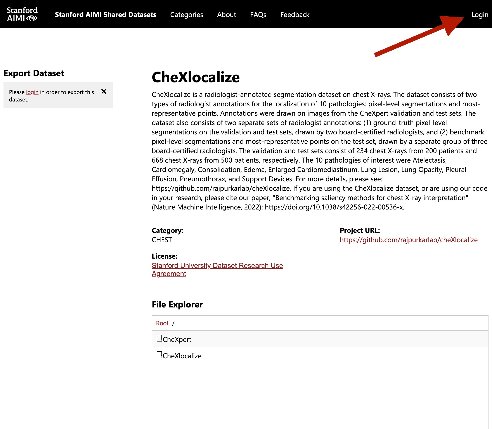
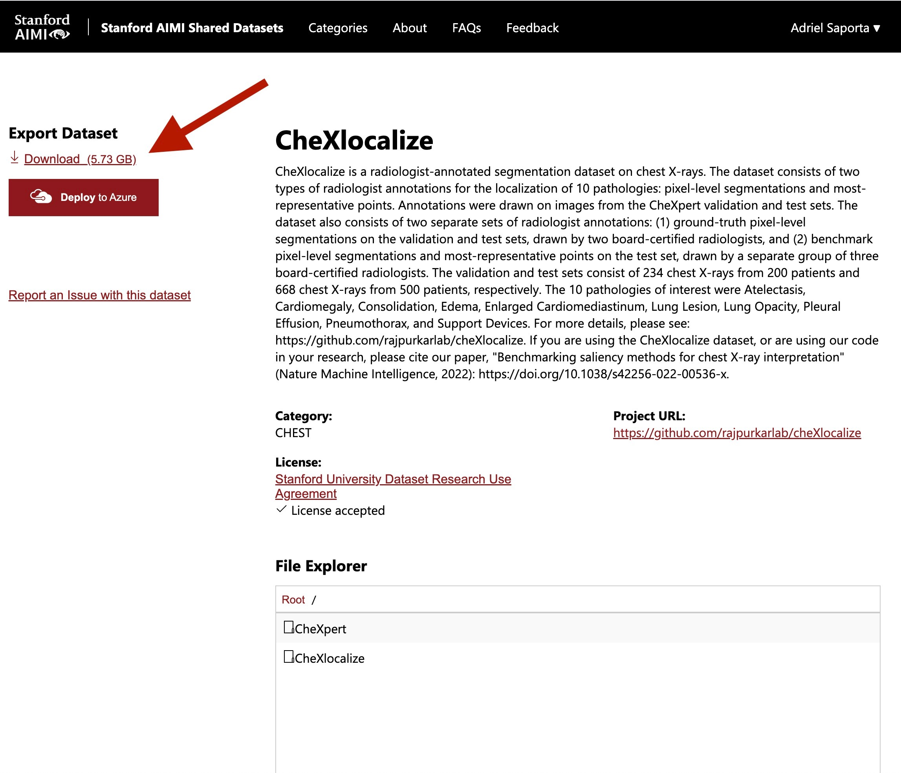
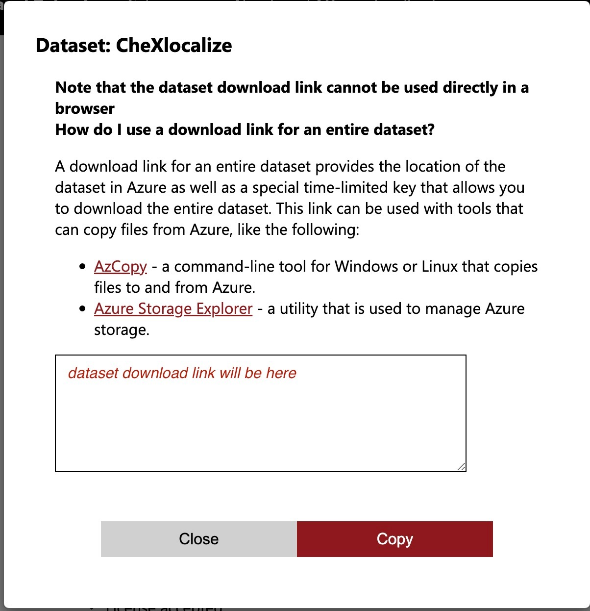
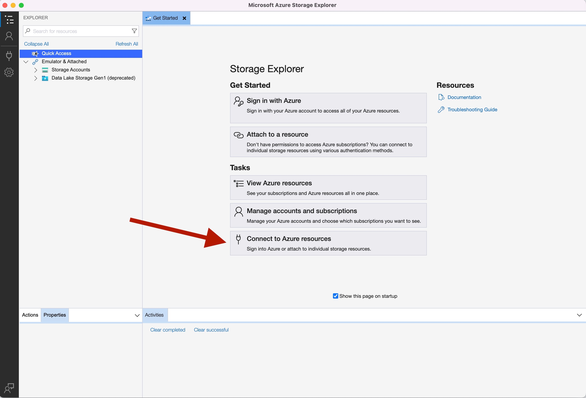
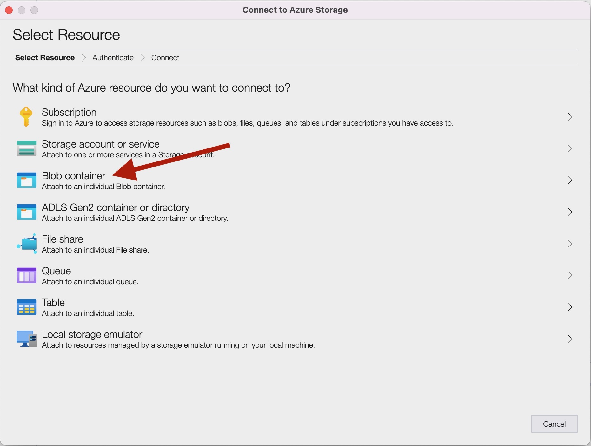
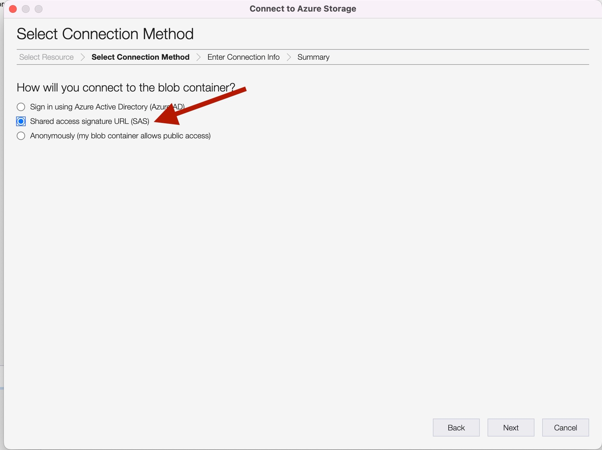
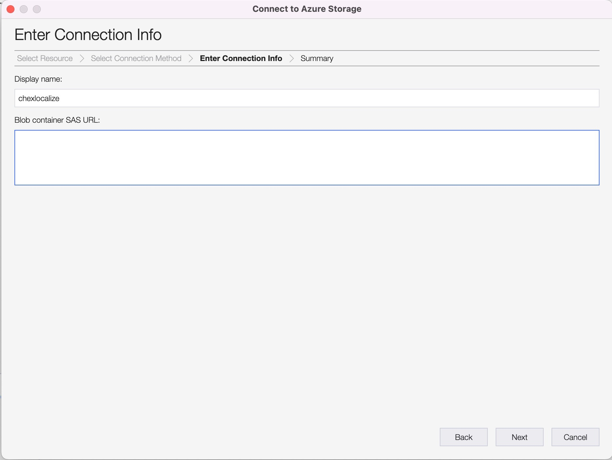
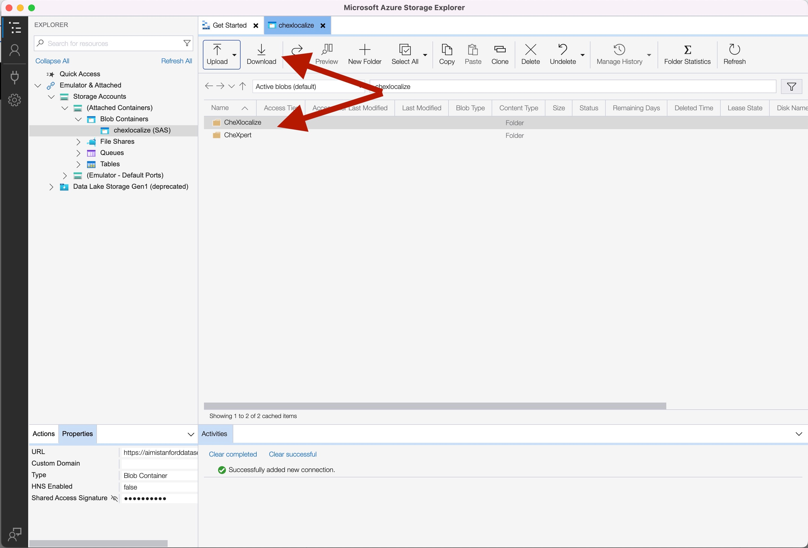

# How to download the CheXlocalize dataset

The CheXlocalize dataset can be found [here](https://stanfordaimi.azurewebsites.net/datasets/23c56a0d-15de-405b-87c8-99c30138950c).

First, login or create an account with StanfordAIMI.

---

---

You should then see this link to download the dataset. Click this link. (Note that you may not be able to see this button using Firefox as a browser, but it should work on Google Chrome.)

---

---

You'll see a registration form pop up. Fill it out, accept the terms of agreement, and click Submit.

---

---

You should then see a pop up with a dataset download link.

---

---

Note that this link cannot be used directly in a browser. We recommend using [Azure Storage Explorer](https://azure.microsoft.com/en-us/products/storage/storage-explorer/) to download the dataset. Download and open Azure Storage Explorer, and click on the plug icon that reads _Connect to Azure resources_.

---

---

You'll be asked to select an Azure resource to connect to; select _Blob container_.

---

---

You'll be asked to select a connection method; select _Shared access signature URL (SAS)_.

---

---

You'll be asked to enter connection info. In the box named _Blob container SAS URL_ enter the data download link given by the StanfordAIMI website above. The _Display name_ will automatically fill in. Click next.

---

---

You should then see the CheXlocalize and CheXpert folders available in Azure Storage Explorer, with a download link you can use to download both folders.

---

---

Feel free to email Adriel Saporta (adriel@nyu.edu), or to open an issue in this repo, with any questions.
